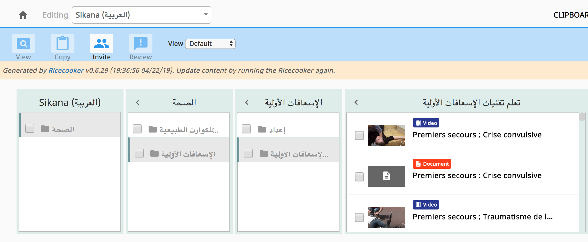
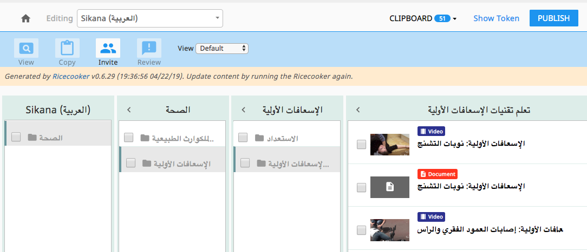

# ricecookr.io
Integration of Sikana's content into Learning Equality's [Kolibri Studio](https://studio.learningequality.org/).

Uses [Ricecooker](https://github.com/learningequality/ricecooker) framework.


### Sikana languages

Main channels:
  - fr: https://studio.learningequality.org/channels/8ef625db6e86506c9a3bac891e413fff/edit
  - es: https://studio.learningequality.org/channels/30c71c99c42c57d181e8aeafd2e15e5f/edit
  - en: https://studio.learningequality.org/channels/3e464ee12f6a50a781cddf59147b48b1/edit
  - ru: https://studio.learningequality.org/channels/757fe48770be588797d731b683fcc243/edit
  - tr: https://studio.learningequality.org/channels/cfa63fd45abf5b7390b1a41f3b4971bb/edit
  - pl: https://studio.learningequality.org/channels/fe95a8142b7952e0a0856944a2295951/edit
  - pt: https://studio.learningequality.org/channels/2871a3680d665bd1a8923660c8c0e1c7/edit
  - pt-br: https://studio.learningequality.org/channels/c367b7d7cf625b9aa525972cad27c602/edit
  - ar: https://studio.learningequality.org/channels/09d96cfabec451309066517930bdab9f/edit
  - zh: https://studio.learningequality.org/channels/3e9ffc29aa0b59c3bda8d8c7ed179685/edit
  - zh-tw: https://studio.learningequality.org/channels/6583e111dac85239bb533f26fae6860d/edit


### Sikana's data structure
For each language, you'll find the content organized as follow:

```
Category
`-- Program
    `-- Chapter
        `-- Video
```

This script intends to create a Sikana channel per language ("Sikana EN", "Sikana FR", ...)


### Installation instructions
For this, you will need to have `python3` and [`virtualenv`](https://virtualenv.pypa.io/en/stable/)
installed on your machine (please read the manual to understand basically how it works).

In the directory containing the code, run following commands:
  - `virtualenv -p python3 venv`
  - `source venv/bin/activate`
  - `pip3 install -r requirements.txt`
  - Then, copy-paste `credentials/parameters.yml.dist` to `credentials/parameters.yml`
    and fill it with your credentials to Sikana's API and Kolibri token.

### Running the chefs
Each time you want to use the script, you have to ensure the `virtualenv` you
previously created is activated (it appears in your prompt).
If not, run the command `source venv/bin/activate`.

Run the following commands to build a channel for the language of your choice:

    source credentials/proxy_list.env
    ./sushichef.py --token=<CHANNELADMIN_TOKEN> language_code=<LANGUAGE_CODE_HERE>

You can find the `<CHANNELADMIN_TOKEN>` Studio API token in the file `credentials/parameters.yml`.


To run all the chef for all languages, run the following commands:

    source credentials/proxy_list.env 
    nohup ./uploadchannels.py &

Note: this will likely take a whole day for the first time.


### Production setup

Currently setup on `vader` under the `/data/sushi-chef-sikana` folder.


## Corrections
The content channels we import from the Sikana API requires various correction
to be applied (typo fixes and translations). The sections below describe the 
corrections that must be manually applied after each chef run for the specific 
channels. See the [corrections docs](https://ricecooker.readthedocs.io/en/latest/developer/corrections.html) for more info.


### Arabic
The content we obtain from the Sikana API contains certain videos in Arabic that
have titles and descriptions in French. In order to enhance the usability of this
channel, we use the [corrections workflow](https://ricecooker.readthedocs.io/en/latest/developer/corrections.html)
to replace the French titles with titles in Arabic.

  - [Studio channel](https://studio.learningequality.org/channels/09d96cfabec451309066517930bdab9f/edit/09d96cf)
  - [List of corrections to apply](https://docs.google.com/spreadsheets/d/1O0eE6grpp65OlW06B9gH8mNd93vDMKmFso_DNkuOCZA/edit#gid=0)

Before corrections:



Applying the corrections:

    corrections apply 09d96cfabec451309066517930bdab9f \
        --gsheet_id=1O0eE6grpp65OlW06B9gH8mNd93vDMKmFso_DNkuOCZA --gid=0 \
        --modifyattrs='title,description'

After corrections have been applied:



As can be seen in the above screenshot, the French titles have been replaced with
the Arabic translations.


Note the corrections must be re-applied after each chef run and the
[corrections gsheet](https://docs.google.com/spreadsheets/d/1O0eE6grpp65OlW06B9gH8mNd93vDMKmFso_DNkuOCZA/edit#gid=0)
may need to be updated if new nodes are added.

